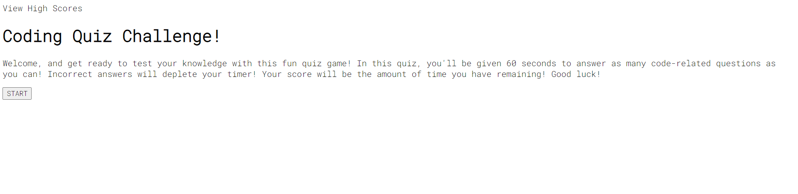

# Coding Quiz

This is a quick JavaScript-based quiz game to test the player's coding knowledge. It creates elements with JavaScript and allows users to save high scores to localStorage as well as display them on a local leaderboard.
https://jtboyman.github.io/coding-quiz/

## Preview

## Usage

Simply click the start button to begin the game, or click View High Scores to check the leaderboard for your high scores. Answer questions by clicking on the answer buttons.

## Roadmap

-Add additional questions
-Refactor code to optimize/shorten length
-Add additional CSS for aesthetics

## Contributing

A helpful feature is that the rest of the code doesn't need to be changed at all as more questions are added - only the answers and questions arrays. Adding additional questions is thus very simple. Any input and additional quiz questions are appreciated via opening issues on Github.
